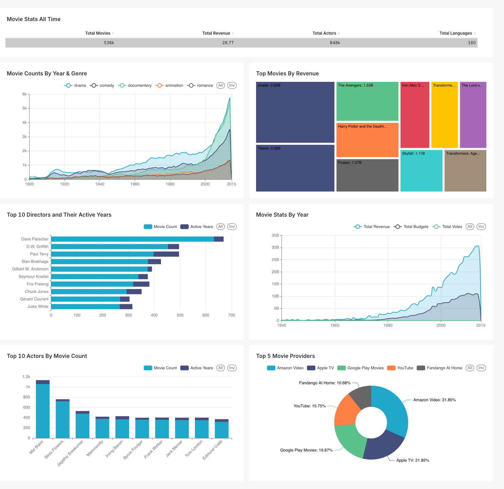

# TMDB Pipeline (WIP)
The TMDB pipeline utilizes the [TMDB API](https://developer.themoviedb.org/docs/getting-started) to extract movie data from various endpoints, transform that data, and load it into a data lake within AWS.

## Overview

### Ingestion
- Data is pulled from multiple TMDB endpoints using AWS Lambda functions.
- The process starts by hitting the **/movies**  endpoint to fetch movie IDs. Subsequent jobs use those IDs to fetch movie details (e.g.  cast,crew, watch providers, etc).

### Transformation
- AWS Glue Python shell jobs and Polars handle all transformations. The transformation jobs are idempotent rerun or reuse without duplicating or reprocessing data.
- This includes both cleaning raw data and computing pre-aggregated datasets for analytics.
- Final outputs feed into an Apache Superset dashboard.

### Orchestration & Infrastructure
- Airflow orchestrates all tasks via daily DAGs.
- Infrastructure is fully managed using Terraform.
- Superset dashboard auto-updates with each new data run.

## Project Structure
- `glue_utils/` – Glue helper utilities  
- `jobs/`  
  - `ingestion_jobs/` – Lambda jobs for ingesting TMDB data  
  - `transformation_jobs/` – Glue jobs for transformations  
  - `analytics_jobs/` – Glue jobs for computing superset datasets
- `src/`  
  - `analytics/` – Analytics layer logic  
  - `ingestion/` – TMDB data extraction and ingestion logic  
  - `transformation/` – Data transformation logic  
  - `sql/` – SQL scripts
  - `utils/` – Utility functions 
- `tests/` 
  - `transformation_tests/`  - Unit tests for transformation logic
- `terraform/` – Infrastructure as Code (Terraform scripts for AWS)  

## Dashboard

